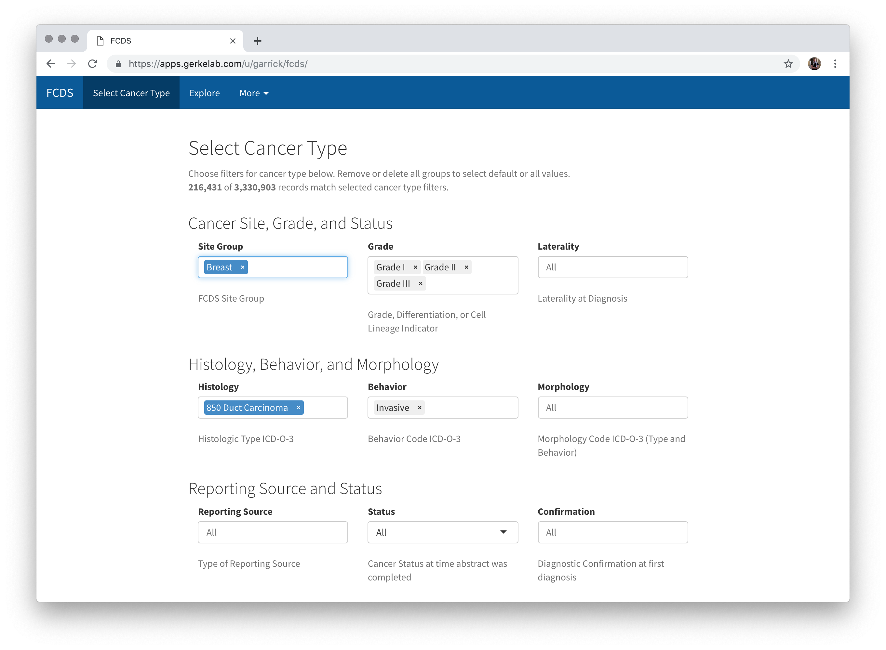

```{r setup, include=FALSE}
knitr::opts_chunk$set(message = FALSE, warning = FALSE, dev.args=list(bg = "transparent"))
```

```{css echo=FALSE}
/* Adjust space at top of #hero (center panel) */
#hero {
  padding-top: 15%;
}

#fcds-app {
  text-align: right;
  width: 100%;
}

#fcds-rpkg {
  padding-top: 25%;
}

#left-bar {
  background-size: 80%;
}

#right-bar img {
  width: 85%;
  padding-left: 6%;
}

#url {
  position: absolute;
  bottom: 2%;
  left: 6%;
}

html {
  -moz-transform: scale(0.4);
  -moz-transform-origin: 0 0;
  zoom: 40%;
}
```


<div id="hero">
<!--
  Center Column of Poster

  * The main text goes in <h1> (single #) header.
  * You can add additional text if desired.
-->
<h1 id="fcds-app">**FCDS Explorer**<br />is a _web app_ for exploring<br>**interactive cancer statistics**</h1>

<h1 id="fcds-rpkg">**fcds**<br/>is an _R Package_ for<br>**tidy data processing** of<br>**Florida Cancer Registry Data**<br /></h1>

<div id="url">https://gerkelab.github.io/fcds</div>

</div>


<div id="left-bar">
<!-- Text in the left bar, title and authors added automatically -->

## Abstract

Understanding and adapting to the specific needs of cancer patients within Moffitt's catchment area, and more broadly across Florida, is critical to achieving Moffitt's IMPACT 2028 goals [@impact2028] and CCSG Center of Excellence status.
To this end, the Florida Statewide Cancer Registry [@fcds] provides a comprehensive database of cancer diagnoses throughout Florida via the Florida Cancer Data System (FCDS).
The goal of this work is provide a consistent and broadly accessible interface to FCDS resources.
We presents a web application and a software package, **fcds**, to clean and harmonize FCDS cancer registry data to facilitate integration of highly-specific regional cancer incidence data within research data analyses of Moffitt patient information.

## R Package Highlights

The primary output of this work is software package for the R statistical computing environment [@rproject] to facilitate analysis and use of FCDS cancer registry data with a clear and consistent data structure as advocated in _Tidy Data_ by Hadley Wickham [@tidy-data].

### Import and Clean FCDS Cancer Statistics Data

```{r eval=FALSE}
library(tidyverse)
library(fcds)
fcds <- fcds_import("STAT_dataset_2018.dat")

# Load previously imported data
fcds <- fcds_load()
```

```{r include=FALSE}
library(tidyverse)
library(fcds)
fcds <- fcds_load()
```

### Subset and Count Cancer Incidence

```{r fcds-count}
fcds_moffitt_prostate <- fcds %>% 
  filter(cancer_site_group == "Prostate Gland", year > 1985) %>% 
  filter_age_groups(age_gt = 20) %>% 
  count_fcds(sex = "Male", moffitt_catchment = TRUE)
```

```{r echo=FALSE}
knitr::kable(head(fcds_moffitt_prostate, 5))
```

### Calculate Age-Adjusted Rates

```{r fcds-aa}
fcds_moffitt_prostate <- fcds_moffitt_prostate %>% 
  complete_age_groups(age_gt = 20) %>% 
  age_adjust() %>% 
  mutate(n = n / 5, rate = rate / 5)
```

```{r echo=FALSE}
knitr::kable(head(fcds_moffitt_prostate, 5))
```


### Interactive and Static Maps

```{r fcds-gg, eval=FALSE}
fcds_map(fcds_moffitt_prostate) +
  facet_wrap(~ year_group) +
  ggtitle("Prostate Cancer in Moffitt Catchment Area",
          "Age-Adjusted Rates, Men Aged 20+") +
  labs(fill = "Mean Yearly\nAge-Adjusted Rate") +
  theme(legend.position = "bottom")
```

```{r fcds-gg-actual, echo=FALSE, fig.height=7, fig.width=6, fig.retina=3, out.width="95%"}
g <- 
<<fcds-gg>>
  
g +
  theme(
    plot.background = element_rect(fill = "transparent", color = NA)
  )
```


</div>


<div id="right-bar">
<!-- Right bar -->

# FCDS Explorer

The **fcds** R package powers and enables an easy-to-use and accessible web application for Moffitt researchers.
The web application, called _FCDS Explorer_, is built using the R Shiny framework [@shiny] and provides features for summarizing and presenting the FCDS data.

## Select Specific Cancer Types



## View Incidence on Interactive Map


## Summarize Cancer Incidence Tables


## Reference ICD-O-3 Code List


</div>

# References
